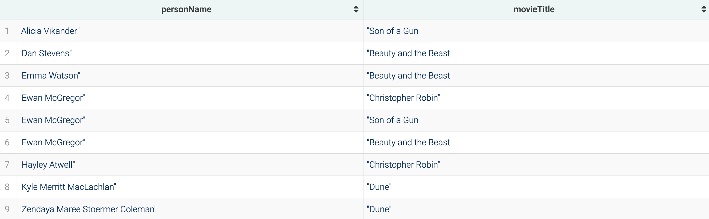

# Assignment 2

by Lukas Hofstetter - 51820745

```
⚠️⚠️⚠️ One-click-coopy version hosted on: ⚠️⚠️⚠️
```

```
https://github.com/hofslu/ISS-A2_Hofstetter_51820745_Report/blob/main/A2_Hofstetter_51820745_Report.md
```

## Task 1

### SELECT queries – please implement one of these queries:

#### Q1: Return all films

```sql
PREFIX : <http://semantics.id/ns/example/film#>
SELECT ?film WHERE {
    ?film a :Film .
}
```


#### Q2: Return all films with their title

### ASK queries – please implement one of these queries:

#### Q3: Is there a film named “Dune”?

```sql
PREFIX : <http://semantics.id/ns/example/film#>
PREFIX rdfs: <http://www.w3.org/2000/01/rdf-schema#>
ASK WHERE {
    ?film a :Film ;
          rdfs:label "Dune" .
}
```


#### Q4: Is there a film named “Dune” released before 1984?

### DESCRIBE queries – please implement one of these queries:

#### Q5: Give me all information about “Dune” movie released in 1984

```sql
PREFIX : <http://semantics.id/ns/example/film#>
PREFIX rdfs: <http://www.w3.org/2000/01/rdf-schema#>
PREFIX xsd: <http://www.w3.org/2001/XMLSchema#>
DESCRIBE ?film WHERE {
    ?film a :Film ;
          rdfs:label "Dune" ;
          :releaseYear "1984"^^xsd:integer .
}
```


#### Q6: Give me all information about actors which are playing in “Dune” released in 1984

### SPARQL CONSTRUCT queries – please implement one of these queries and additionally build a query of your own with code Q9

#### Q7: Return all writers and the film studios for which they have worked

```sql
PREFIX ex: <http://semantics.id/ns/example/film#>

CONSTRUCT {
    ?writer ex:hasWorkedFor ?studio .
} WHERE {
    ?film ex:hasScriptWriter ?writer .
    ?film ex:hasFilmStudio ?studio .
}
```


#### Q8: Return all actors and directors who know each other from movies

#### Q9: Constructing playedInGenre Relationship

```sql
PREFIX ex: <http://semantics.id/ns/example/film#>

CONSTRUCT {
    ?actor ex:playedInGenre ?genre .
} WHERE {
    ?film ex:hasActor ?actor ;
          ex:hasGenre ?genre .
}
```


### FILTER queries – please implement one of these queries and additionally build a query of your own with code Q13

#### Q10: Select film studios that were established after 1960

```sql
PREFIX ex: <http://semantics.id/ns/example/film#>
PREFIX xsd: <http://www.w3.org/2001/XMLSchema#>

SELECT ?studio ?date WHERE {
    ?studio a ex:FilmStudio ;
            ex:establishedDate ?date .
    FILTER (?date >= "1960-12-31"^^xsd:date)
}
```


#### Q11: Select unique name of actors who play in movies between 2014 and 2020

#### Q12: Select name of actors who play in movies released after 2016 and with title containing string “Beauty”

### Q13 Actors in Family Genre Films Born After 1980

```sql
PREFIX ex: <http://semantics.id/ns/example/film#>
PREFIX xsd: <http://www.w3.org/2001/XMLSchema#>

SELECT ?actorName ?birthdate WHERE {
    ?film ex:hasActor ?actor ;
          ex:hasGenre ex:genre_family .
    ?actor ex:fullName ?actorName ;
           ex:dateOfBirth ?birthdate .
    FILTER (?birthdate > "1980-01-01"^^xsd:date)
}
```


### ORDER and GROUP queries – please implement one of these queries and additionally build a query of your own with code Q16

#### Q14: Select name of actors who plays in movies ordered by birthdate (ascending)

```sql
PREFIX ex: <http://semantics.id/ns/example/film#>
PREFIX rdfs: <http://www.w3.org/2000/01/rdf-schema#>

SELECT DISTINCT ?actorName ?actor ?birthdate WHERE {
    ?film ex:hasActor ?actor .
    ?actor a ex:Actor ;
           ex:dateOfBirth ?birthdate ;
           ex:fullName ?actorName .
}
ORDER BY ?birthdate
```


#### Q15: Count the average number of ScriptWriters involved in each movie!

#### Q16 Count Films per Actor

```sql
PREFIX ex: <http://semantics.id/ns/example/film#>

SELECT ?actor (COUNT(?film) AS ?numberOfFilms) WHERE {
    ?film ex:hasActor ?actor .
} GROUP BY ?actor
ORDER BY DESC(?numberOfFilms)
```


### UNION queries – please implement this query without utilizing inference mechanisms:

#### Q17: List all actors and crews together with the title of movies that they are involved in, ordered by their name.

```sql
PREFIX ex: <http://semantics.id/ns/example/film#>
PREFIX rdfs: <http://www.w3.org/2000/01/rdf-schema#>

SELECT ?personName ?movieTitle WHERE {
    {
        ?film ex:hasActor ?person .
        ?person ex:fullName ?personName .
    }
    UNION
    {
        ?film ex:hasCrew ?person .
        ?person ex:fullName ?personName .
    }
    ?film rdfs:label ?movieTitle .
}
ORDER BY ?personName
```



## Task 2

### dpedia Querries

http://dbpedia.org/sparql

#### Q18: How many South Korean movies are listed in DBPedia?

```sql
PREFIX dbo: <http://dbpedia.org/ontology/>

SELECT (COUNT(?movie) AS ?numberOfMovies) WHERE {
    ?movie a dbo:Film ;
           dbo:country dbr:South_Korea .
}
```


#### Q19: Find all movies released after year 2000.

```sql
PREFIX dbo: <http://dbpedia.org/ontology/>
PREFIX dbr: <http://dbpedia.org/resource/>

SELECT ?movie ?date
WHERE {
  ?movie a dbo:Film ;
         dbo:releaseDate ?date .
  FILTER (YEAR(?date) > 2000)
}
ORDER BY ?date
-- ORDER BY DESC(?date)
LIMIT 10
```


#### Q20: Find all movies directed by Steven Spielberg where Tom Hanks is not playing

```sql
PREFIX dbo: <http://dbpedia.org/ontology/>
PREFIX dbr: <http://dbpedia.org/resource/>

SELECT ?movie WHERE {
    ?movie a dbo:Film ;
           dbo:director dbr:Steven_Spielberg .
    MINUS { ?movie dbo:starring dbr:Tom_Hanks }
}
```


### Additional Querries

Additionally, please propose and implement 2 complex queries of your own including (any combination of) FILTER, ORDER, GROUP, UNION. Name these Q21 and Q22

#### Q21 Count of Philosophers by Era (with More Than One Philosopher)

```sql
PREFIX dbo: <http://dbpedia.org/ontology/>

SELECT ?era (COUNT(?philosopher) AS ?numberOfPhilosophers) WHERE {
    ?philosopher a dbo:Philosopher ;
                 dbo:era ?era .
} GROUP BY ?era
HAVING (COUNT(?philosopher) > 1)
ORDER BY DESC(?numberOfPhilosophers)
```


#### Q22 Analysis of International Collaboration in Space Missions Post-2000

```sql
PREFIX dbo: <http://dbpedia.org/ontology/>
PREFIX dbp: <http://dbpedia.org/property/>
PREFIX xsd: <http://www.w3.org/2001/XMLSchema#>

SELECT ?missionType ?missionCategory (YEAR(SAMPLE(?missionDate)) AS ?missionYear) (COUNT(DISTINCT ?astronautNationality) AS ?numberOfCountriesOrAgencies) ?mission WHERE {
    {
        ?astronaut a dbo:Astronaut .
        ?mission a dbo:SpaceMission ;
                 dbp:missionType ?missionType ;
                 dbo:launchDate ?missionDate .
        ?astronaut dbo:mission ?mission .
        OPTIONAL { ?astronaut dbo:nationality ?nation . }
        OPTIONAL { ?astronaut dbo:employer ?agency . }
        BIND(COALESCE(?nation, ?agency) AS ?astronautNationality)
        FILTER (YEAR(?missionDate) > 2000)
        BIND("Crewed" AS ?missionCategory)
    }
    UNION
    {
        ?mission a dbo:SpaceMission ;
                 dbp:missionType ?missionType ;
                 dbo:launchDate ?missionDate .
        FILTER NOT EXISTS { ?mission dbo:crew ?crew }
        FILTER (YEAR(?missionDate) > 2000)
        BIND("Uncrewed" AS ?missionCategory)
    }
}
GROUP BY ?missionType ?mission ?missionCategory
HAVING (COUNT(DISTINCT ?astronautNationality) >= 0)
ORDER BY DESC(?missionYear)
```


## Task 3

### Q23: RDFS Domain Entailment

In Q23, we explore the concept of RDFS Domain Entailment. This entailment pattern is based on the idea that if a property has a defined domain, any resource that has this property implies that the resource is an instance of the domain class. For instance, if a property ex:hasPerformer is defined with the domain ex:Artwork, then any subject with this property can be inferred to be an instance of ex:Artwork. This query demonstrates how inference can extend the understanding of data, revealing implicit class memberships that are not explicitly stated but are logically consistent with the ontology's structure.

```sql
PREFIX ex: <http://semantics.id/ns/example/film#>

SELECT ?subject WHERE {
    ?subject ex:hasPerformer ?crew .
}
```

Without Inference Enabled: The query will return ?artwork that has a hasPerformer relationship without considering the class hierarchy. It means if some instances are not explicitly typed as Artwork but have a hasPerformer relationship, they may not be returned.


With Inference Enabled: This query will return all ?artwork that is related to ?performer through ex:hasPerformer. The inference will recognize that any ?artwork with a hasPerformer relationship is an instance of Artwork or its subclasses, even if it's not explicitly typed as such.


### Q24: RDFS Sub-Property Entailment

Q24 is centered around the RDFS Sub-Property Entailment. In this pattern, if a property (say ex:hasLeadActor) is defined as a sub-property of another property (ex:hasActor), then all instances of the sub-property are also inferred to be instances of the super-property. This allows us to query for the super-property and retrieve results that include its sub-properties. The query showcases how this entailment enriches query results by capturing relationships that are not explicitly stated but are inherent in the ontology's property hierarchy

Therefor first a SubProperty needed to be created:

```sql
PREFIX ex: <http://semantics.id/ns/example/film#>
PREFIX rdfs: <http://www.w3.org/2000/01/rdf-schema#>

INSERT DATA {
    ex:hasLeadActor rdfs:subPropertyOf ex:hasActor .
}
```

and an instance added:

```sql
PREFIX ex: <http://semantics.id/ns/example/film#>

INSERT DATA {
    ex:film_1 ex:hasLeadActor ex:zendaya .
}
```

to check with:

```sql
PREFIX ex: <http://semantics.id/ns/example/film#>

SELECT ?film ?actor WHERE {
    ?film ex:hasActor ?actor .
}
```

Without Inference Enabled: The query will not include :zendaya for #film_1.

With Inference Enabled: The query returns #film_1 and :zendaya among other films and actors, showing the entailment from ex:hasLeadActor to ex:hasActor.


### Q25: OWL Class Hierarchy Entailment

Q25 focuses on demonstrating OWL Class Hierarchy Entailment. This entails that instances of a subclass are also considered instances of its superclass. For instance, if ex:Actor is a subclass of ex:Performer, then all instances of ex:Actor are also inferred to be instances of ex:Performer. Our query illustrates this principle by selecting instances of a superclass and revealing how, with inference, it includes instances of its subclasses. This showcases the power of OWL reasoning in revealing implicit instance relationships based on class hierarchies.

```sql
PREFIX ex: <http://semantics.id/ns/example/film#>

SELECT ?instance WHERE {
    ?instance a ex:Performer .
}
```

Without Inference Enabled: The query will return only the direct instances of ex:Performer and not the instances of its subclasses (such as ex:Actor).

With Inference Enabled: This query will return instances of ex:Performer and all of its subclasses (like ex:Actor). It illustrates how class hierarchy reasoning includes instances of subclasses under the superclass.

